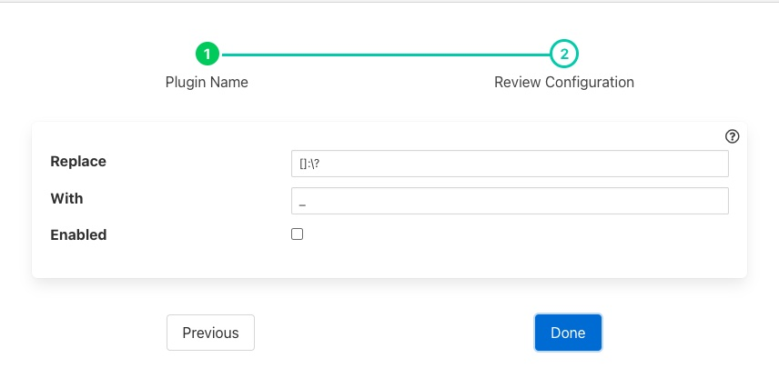

.. Images

Replace Filter
==============

The *fledge-filter-replace* is a filter that allows an be used to replace all occurrence of a set of characters with a single replacement character. This can be used to change reserved characters in the names of assets and datapoints.

+-----------+
| |replace| |
+-----------+

  - **Replace**: The set of reserved characters to be replaced.

  - **With**: The character to replace each occurrence of the above characters with

